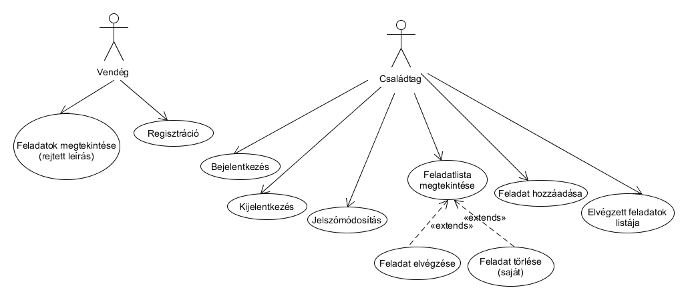
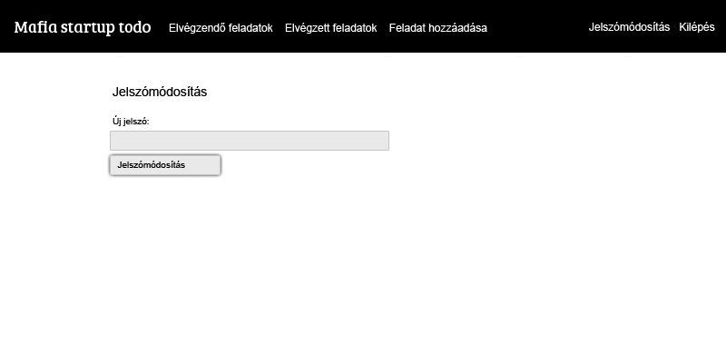
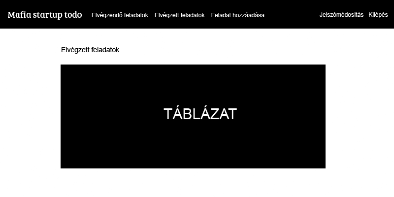

# Mafia startup todo

Ha a szervezett bűnözésnek készítenénk todo rendszert, természetesen nem így csinálnánk. Ez inkább szimuláció.

##Funkcionális követelmények
*Vendégként:*

+ szeretném látni az aktuális feladatok listáját (rejtett szöveggel)
+ szeretnék regisztrálni, hogy családtagként én is elvégezhessek feladatokat

*Felhasználóként:*

+ szeretnék belépni az oldalra
+ szeretném elolvasni a feladat címét, pontos leírását és nehézségét
+ szeretném elvégezni a feladatot
+ szeretném a jelszavamat megváltoztatni
+ szeretnék feladatot hozzáadni
+ szretnék feladatot törölni (csak sajátot)
+ szeretném megnézni az elvégzett feladatok listáját
+ szeretnék kijelentkezni

##Nem funkcionális követelmények

+ Felhasználóbarát, átlátható
+ Biztonságos
+ Gyors hozzáférés, rövid válaszidő

##Use-case

##Adatmodellek

##Szerepkörök és jogosultságok
+ *Vendég:* megnézheti az aktuális feladatok listáját és a feladatokhoz tartozó nehézséget (de nem láthatja a feladat címét és leírását, ez "titkos"). Ezenkívül regésztrálhat a családba, hogy ő is hozzájárulhasson a "cég" tevékenységéhez.
+ *Családtag:* láthatja az aktuális teljes feladatlistát, azaz címeket, leírásokat és nehézségeket. Feladatot jelölhet elvégzettnek, új feladatot adhat hozzá, saját maga által hozzáadott feladatokat törölhet, megnézheti az eddig elvégzett feladatok listáját.

##Oldaltérkép
**Vendég (publikus):**
+ Feladatlista (hiányzó leírás)
+ Bejelentkezés
+ Regisztráció

**Családtag:**
+ Feladatlista (teljes)
  + Feladat elvégzése
  + Feladat hozzáadása
  + Feladat törlése (csak saját)
+ Profiladatok
  + Jelszómódosítás
+ Kijelentkezés

##Folyamatok
Új feladat hozzáadása  
  
Feladat elvégzése  
  
Felhasználó bejelentkezése  

##Végpontok
+ **GET/:** feladatlista megtekintése
+ **GET/reg:** regisztrációs oldal megtekintése
+ **POST/reg:** regisztrációs kérés küldése
+ **GET/login:** bejelentkező oldal megtekintésée
+ **POST/login:** bejelentkezési adatok küldése
+ **GET/logout:** kijelentkezés kérése
+ **GET/do/:id:** feladatelvégzés jelentésének kérése
+ **GET/del/:id:** feladattörlés kérése
+ **GET/history:** elvégzett feladatok listájának megtekintése
+ **GET/password:** jelszómódosító oldal megtekintése
+ **POST/password:** jelszófrissítés küldése
+ **GET/add:** feladathozzáadás oldalának megtekintése
+ **POST/add:** feladathozzáadás kérésének küldés
+ **POST/ajaxlogin:** ajax bejelentkezés
+ **GET/ajaxlogout:** ajax kijelentkezés
+ **POST/ajaxregcheck:** ajax regisztráció
+ **POST/ajaxchangepass:** ajax jelszómódosítás
+ **GET/ajaxdeljob/:id:** ajax feladattörlés

##Ajax funckiók
+ bejelentkezés
+ kijelentkezés
+ regisztráció
+ jelszómódosítás
+ feladattörlés

##Tesztesetek

A tesztek a Selenium IDE Firefox pluginnal készültek. A rendszer felhasználókat szimulál a böngészőben (például gépelés, kattintás, stb). A tesztesetek a test mappában találhatók, pontosabban:

+ test/loginSuite
  + login (bejelentkezés teszt)
  + badLogin (sikertelen bejelentkezés teszt)
  + logout (kijelentkezés teszt)
+ test/regSuite
  + reg (regisztráció teszt)
  + regFail (sikertelen regisztráció teszt)
  + regFail2 (sikertelen regisztráció teszt 2)
+ test/passSuite
  + passChange (jelszóváltoztatás teszt)
  + passChangeFail (sikertelen jelszóváltoztatás teszt)
+ test/taskSuite
  + addTask (feladat hozzáadása teszt) 
  + delTask (feladat törlése teszt)
  + doneTask (feladat elvgézése teszt)

##Oldalvázlatok
Jelszómódosítás:
  
Feladat hozzáadása:
  
Elvégzett feladatok listája:

##Telepítés

+ ZIP letöltése, vagy
+ szabonorbert/alkfejl20162 klónozása, vagy
+ szabonorbert/alkfejl20162 forkolása és a saját repo klónozása

Beállítás után a szoftvert az "npm run dev" paranccsal érdemes futtatni, böngészőben a "localhost:3333" címen lesz elérhető.

##Mappaszerkezet

A szoftver működése szempontjából fontosabb mappák:

+ resources/views: itt találhatók meg a a megjelenítendő oldalak (HTML)
+ database: itt találhatók a migration-ök
+ App/Http: a Controllerek, amik az adatbázis és a view-k közti kommunikációt valósítja meg, s a routes.js fájl, ahol a route-okat találjuk
+ App/Model: az adatbázismodellek helye
+ public: a script.js helye

##Szoftver követelmények

Node.js szerver, azt kiszolgálván pedig pedig bármilyen operációs rendszer, ami futtatni képes azt. Az alkalmazás Node.js v7.1.0 alatt lett tesztelve.